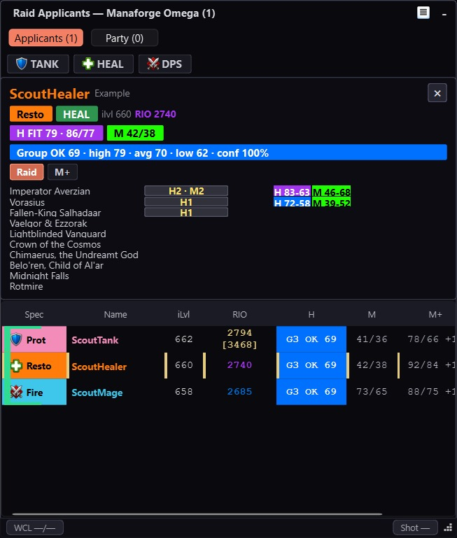
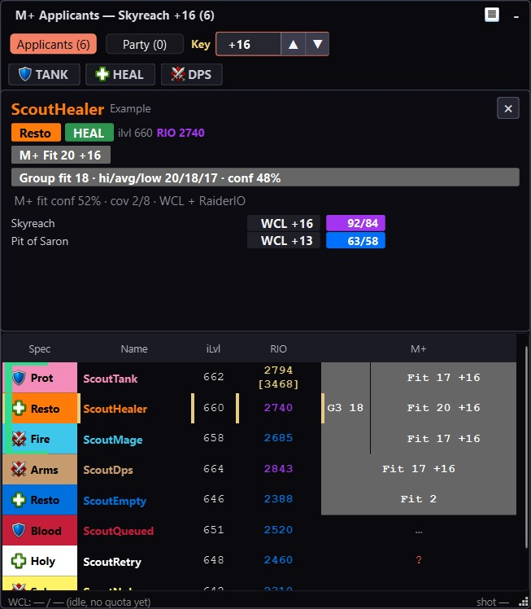

# ApplicantScout: LFG & Party Overlay

<p>
  <a href="https://github.com/Antrakt92/ApplicantScout-Addon/releases/latest"></a>
  <a href="https://github.com/Antrakt92/ApplicantScout-Companion/releases/latest"></a>
  
  
</p>

> Pick applicants faster. Know the group you just joined.

ApplicantScout is the in-game half of a Warcraft Logs + RaiderIO overlay for
WoW Group Finder. It captures applicant and current party/raid roster snapshots
from Blizzard's UI, sends them through normal WoW screenshots, and pairs with
the Windows companion overlay for the actual WCL/RaiderIO table.

It is built for two moments that usually cost time: choosing who to invite while
your listing fills, and understanding a group you just joined before the key
starts or the first raid pull happens.

<p align="center">
  
  
</p>

> [!IMPORTANT]
> ApplicantScout is a two-part tool. Installing only the WoW addon will not show
> Warcraft Logs or RaiderIO context. You need the addon plus
> [ApplicantScout Companion](https://github.com/Antrakt92/ApplicantScout-Companion/releases/latest).

## Why People Install It

### When you host

- See applicant evidence beside the invite decision instead of rebuilding a
  mini spreadsheet from Warcraft Logs, RaiderIO, and the default LFG list.
- Keep grouped applicants visible as a package while still seeing each member's
  own WCL/RaiderIO signal.
- Keep raid evidence primary for raid listings and M+ evidence primary for
  Mythic+ listings.
- Treat missing logs as missing evidence, not as secretly good or secretly bad.
- Use familiar Warcraft Logs-style colors for faster scanning.

### When you join

- Open Party view and get roster context a few moments after you join someone
  else's group.
- See score spread, raid progress, dungeon context, missing evidence, and role
  mix before the run really starts.
- Use leader-key calibration from ApplicantScout's built-in LibKS-compatible
  shim, without requiring BigWigs or another key-tracker addon.

ApplicantScout is not an auto-invite bot and does not automate gameplay. It is
a decision surface for humans.

## Quick Setup

1. Install ApplicantScout through CurseForge, or download the packaged addon ZIP
   from [the latest addon release](https://github.com/Antrakt92/ApplicantScout-Addon/releases/latest).
2. Install ApplicantScout Companion from
   [the latest companion release](https://github.com/Antrakt92/ApplicantScout-Companion/releases/latest).
   Use `ApplicantScoutCompanionSetup-*.exe`; the portable ZIP is mainly for
   manual/dev use.
3. Launch the companion and enter your Warcraft Logs Client ID/Secret.
4. Set the active WoW `_retail_\Screenshots` folder in companion Settings.
5. Reload WoW, then host a Mythic+ or raid listing, or join a group and use
   Party view to review the current roster.

Manual addon installs should extract the packaged ZIP so the TOC is at
`_retail_\Interface\AddOns\ApplicantScout\ApplicantScout.toc`. Do not use
GitHub's automatic source-code ZIP for normal installs; it extracts to the wrong
folder name for WoW.

## What The Overlay Can Show

- Warcraft Logs raid and Mythic+ percentiles.
- RaiderIO current score, optional main-score context, and local RaiderIO
  dungeon/raid evidence when the RaiderIO addon data is available.
- Role, item level, grouped-applicant packages, and per-player rows.
- Raid-fit cells for Normal/Heroic/Mythic raid listings.
- Target-key fit, dungeon history, and low-evidence markers for Mythic+.
- Current party/raid roster context after invites or after joining a group.
- Optional playstyle and Auto Hi controls for in-game quality-of-life.

## How It Works

WoW addons cannot query Warcraft Logs directly from inside the game client.
ApplicantScout keeps the in-game addon small and uses public UI/screenshot APIs:

1. The addon watches your active Group Finder listing and current party/raid
   roster.
2. It renders compact QR snapshots and triggers normal WoW screenshots.
3. The companion watches the configured Screenshots folder, decodes
   ApplicantScout `APS1` payloads, fetches WCL data, reads optional local
   RaiderIO data, and updates the overlay.
4. The QR frame appears only during the screenshot capture window so it stays
   out of the way between snapshots.

ApplicantScout temporarily raises screenshot quality and uses JPG format only
during each QR capture, then restores your prior screenshot settings after the
screenshot. `/apscout off` and the next `/reload` also restore an interrupted
capture lease defensively.

## Privacy And Trust

ApplicantScout does not read WoW memory, inject code, automate gameplay, or send
chat messages as a transport.

Trust notes for the companion:

- It does not ask for Blizzard credentials or account access.
- It watches only the configured WoW `Screenshots` folder for ApplicantScout QR
  payloads.
- If the RaiderIO addon is installed, it can read local RaiderIO addon database
  files under `_retail_\Interface\AddOns\RaiderIO\db` to enrich score/progress
  context.
- It stores Warcraft Logs API credentials locally under your Windows user
  profile.
- Decoded RaiderIO lookup payloads can be cached under
  `%LOCALAPPDATA%\applicant-scout\cache\raiderio-local`.
- It is source-available in the public companion repository.
- Current Windows builds are unsigned, so SmartScreen can warn on first install;
  the release also publishes a `.sha256` sidecar for file integrity, not
  publisher identity.

Before sharing support material publicly, redact `/apscout status` output,
`/apscout taintcheck` output, companion logs, QR screenshots, manual decode
output, `config.env`, `token.json`, `character-cache.json`,
`last-live-snapshot.json`, and `screenshot-manual-index-v2-*.json`. Treat the
entire `%LOCALAPPDATA%\applicant-scout\config\` and
`%LOCALAPPDATA%\applicant-scout\cache\` directories as private; do not attach
either directory wholesale. These files can include WCL Client ID/Secret,
OAuth access token, character names, realm names, applicant/roster snapshots,
listing titles/comments, screenshots folder paths, absolute screenshot file
paths, keystone/listing metadata, and WCL/RaiderIO evidence.

QR screenshots may remain if the companion is absent, interrupted, pointed at
the wrong folder, or the Screenshots folder is synced/shared before cleanup.

## Handy Slash Commands

The Group Finder panel stays focused on everyday applicant scouting, playstyle,
and Auto Hi controls. Advanced diagnostics and QR recovery remain available
through the slash commands below.

```text
/apscout on | off       enable/disable capture
/apscout toggle         flip enabled state
/apscout config         open/close settings panel
/apscout status         show current state + QR diagnostics
/apscout playstyle [off|learning|relaxed|competitive|carry] set M+ default playstyle
/apscout reset          clear transport cache, queue fresh snapshot
/apscout shotnow        force snapshot now while enabled (debug / manual sync)
/apscout qrvisible      toggle persistent QR always-visible mode; off clears it
/apscout qrmove         toggle QR move mode (Alt+drag QR frame)
/apscout qrreset        reset QR frame position to top-left
/apscout taintcheck     probe C_LFGList field secret-tagging
/apscout debug [on|off] toggle debug logging
/apscout competitive [on|off] legacy alias for Competitive / Off
```

## Compatibility

- WoW Retail Midnight: Interface `120007, 120100`.
- Latest ApplicantScout addon release.
- Latest ApplicantScout Companion release.
- Wire payload: compact v9 (`APS1`) snapshots with optional RaiderIO, raid/M+
  roster, leader-keystone context, and partial snapshot handling. A v11 frame
  is used only when an incomplete applicant read must preserve prior companion
  state. Backlogs that exceed one reliable QR use bounded v10 fragment
  envelopes and are applied only after the complete inner snapshot is rebuilt.
- Classic-era clients are not supported.

## Troubleshooting

- Overlay stays empty: open companion Settings and confirm the Screenshots path
  points at the active `_retail_\Screenshots` folder.
- WoW side looks idle: run `/apscout status` while hosting a listing.
- Need a manual sync: keep ApplicantScout enabled and run `/apscout shotnow`.
- Applicant state looks stale: run `/apscout reset` while transport is active.
- WCL cells stay empty: open companion Settings and use Test WCL.
- QR frame is in the way: run `/apscout qrmove`, Alt-drag it, then run the same
  command again to lock it. Use `/apscout qrreset` to restore the default
  position.

## Local Development

Package a development-only addon ZIP from a clean checkout:

```powershell
.\scripts\package-addon.ps1
```

The script emits `dist\ApplicantScout-<version>.zip`, verifies that the archive
contains a top-level `ApplicantScout\` addon folder, and refuses dirty release
inputs by default. Marketplace releases are produced by the BigWigs packager
from `.pkgmeta`; use the local ZIP only for smoke testing.

For a local Lua syntax check, run:

```powershell
luac5.1 -p ApplicantScout.lua
```

## Support

- Addon source and in-game issues:
  [github.com/Antrakt92/ApplicantScout-Addon](https://github.com/Antrakt92/ApplicantScout-Addon)
- Companion, installer, WCL setup, and overlay issues:
  [github.com/Antrakt92/ApplicantScout-Companion](https://github.com/Antrakt92/ApplicantScout-Companion)

## License

ApplicantScout is MIT licensed; see `LICENSE`.

The bundled `libs/qrencode.lua` library retains its upstream 3-clause BSD
license. See `THIRD-PARTY-NOTICES.md` and the source header in
`libs/qrencode.lua`.
