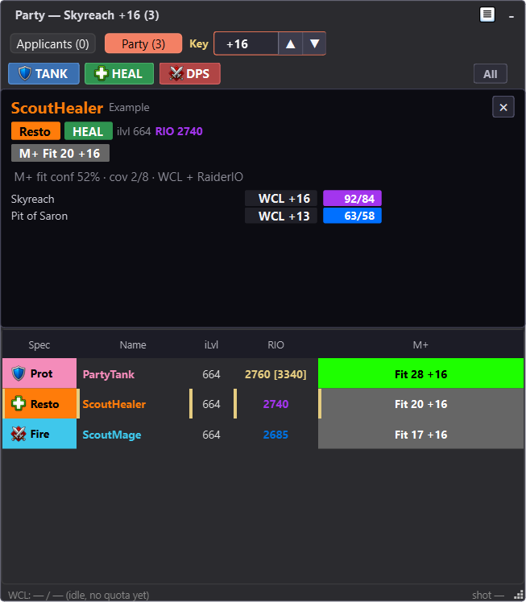

# ApplicantScout: LFG Applicant Overlay

> [!IMPORTANT]
> ApplicantScout is a **two-part tool**. Installing only the WoW addon will not
> show Warcraft Logs / RaiderIO parses by itself. You need both pieces:
>
> 1. **ApplicantScout addon** - installed in WoW through CurseForge or this
>    release.
> 2. **ApplicantScout Companion** - the Windows overlay that decodes screenshots,
>    queries Warcraft Logs, reads local RaiderIO context, and shows the applicant
>    table:
>    [download the latest Windows companion](https://github.com/Antrakt92/ApplicantScout-Companion/releases/latest).

ApplicantScout helps Group Finder leaders review Mythic+ and raid applicants
without alt-tabbing through profiles one by one. The addon captures applicant
snapshots from Blizzard's LFG UI, sends them through QR screenshots, and pairs
with the local ApplicantScout Companion overlay for Warcraft Logs, RaiderIO,
role, group, raid-fit, and key-fit context.

**Actively maintained. Feedback and suggestions are very welcome.**



## Why People Install It

- See applicant evidence beside the invite decision instead of rebuilding a
  mini spreadsheet from Warcraft Logs, RaiderIO, and the default LFG list.
- Review grouped applicants as a package, with group-level fit kept separate
  from each member's own WCL signal.
- Keep missing logs as unknown evidence instead of silently treating every
  low-information applicant as good or bad.
- Use a local companion because WoW addons cannot query Warcraft Logs directly
  from inside the game client.

## What It Does

- Captures Mythic+ and raid applicant snapshots while you host a listing.
- Sends data through QR screenshots instead of chat messages, memory reads, or
  gameplay automation.
- Feeds ApplicantScout Companion, which shows Warcraft Logs raid/Mythic+
  percentiles, RaiderIO current/main score context, role filters, grouped
  applicant packages, raid-fit cells, and a numeric M+ fit score for your listed
  key.
- Shares and reads party keystone data through a small LibKS-compatible protocol
  shim, so leader-key calibration works without requiring BigWigs or another
  key-tracker addon.
- Keeps grouped applications visible together so you can judge packages, not
  just individual rows.
- Defaults new Mythic+ listings to the `Competitive` playstyle, with Off,
  Learning, Relaxed, Competitive, and Carry Offered choices available from the
  settings panel or slash commands.

## Requirements

- World of Warcraft Retail / Midnight 12.x.
- ApplicantScout Companion for the external overlay.
- Warcraft Logs API credentials configured in the companion.
- Optional: RaiderIO addon for current-season main-score and per-dungeon
  completed-key context.
- Optional: DBM, BigWigs, or another LibKeystone-compatible key-tracker addon.
  ApplicantScout has its own LibKS-compatible party shim, so these are not
  required.

## Install In 5 Minutes

### CurseForge

Install ApplicantScout through the CurseForge app. The CurseForge file installs
only the in-game addon, so you still need ApplicantScout Companion for the
overlay.

1. Install ApplicantScout through CurseForge.
2. Install ApplicantScout Companion from
   [the latest companion release](https://github.com/Antrakt92/ApplicantScout-Companion/releases/latest).
   Use the Windows installer asset named `ApplicantScoutCompanionSetup-*.exe`;
   the portable ZIP is mainly for manual/dev use.
3. Launch the companion and enter your Warcraft Logs Client ID/Secret.
4. Set the active WoW `_retail_\Screenshots` folder in companion Settings.
5. Reload WoW, host a Mythic+ or raid listing, and keep ApplicantScout enabled.

### Manual

1. Download the packaged addon ZIP, `ApplicantScout-*.zip`, from the latest
   GitHub Release.
2. Extract the ZIP so the TOC is at
   `_retail_\Interface\AddOns\ApplicantScout\ApplicantScout.toc`.
3. Do not use GitHub's automatic source-code ZIP for normal installs; it extracts
   to the wrong folder name for WoW.
4. Install and start ApplicantScout Companion from
   [the paired companion release](https://github.com/Antrakt92/ApplicantScout-Companion/releases/latest).
5. Reload WoW.
6. Create your Mythic+ or raid listing as usual and keep ApplicantScout enabled
   while scouting applicants.

## Using ApplicantScout

The QR frame defaults to the top-left of the UI and appears only during the
screenshot capture window so it stays out of the way between snapshots. Use
`/apscout qrvisible` for debugging, or `/apscout qrmove` and Alt-drag the QR
frame to move it.

ApplicantScout temporarily raises screenshot quality and uses JPG format while
enabled, then restores your prior screenshot settings when you turn it off with
`/apscout off`.

Open `/apscout config` to set optional in-game conveniences such as the Mythic+
default playstyle and an Auto Hi greeting that fires once after you join a group.
Auto Hi can also greet new party members when enabled; raids are excluded.

## Slash Commands

```text
/apscout on | off       enable or disable capture
/apscout toggle         flip enabled state
/apscout config         open or close the settings panel
/apscout status         show current state and QR diagnostics
/apscout playstyle [off|learning|relaxed|competitive|carry] set M+ default playstyle
/apscout reset          clear transport cache and queue a fresh snapshot
/apscout shotnow        force a snapshot now while enabled
/apscout qrvisible      keep the QR frame visible for debugging
/apscout qrmove         toggle QR move mode; Alt-drag the QR frame
/apscout qrreset        reset QR frame position to top-left
/apscout taintcheck     inspect LFG field secret-tagging diagnostics
/apscout debug [on|off] toggle debug logging
/apscout competitive [on|off] legacy alias for Competitive / Off
```

## Transport And Privacy

ApplicantScout emits versioned `APS1` snapshots through QR screenshots. The
payload is binary and CRC-checked. QR generation uses legacy hex encoding first,
then falls back to raw byte mode when a large snapshot would exceed QR capacity.
The companion accepts both forms.

ApplicantScout does not read WoW memory, inject code, automate gameplay, or send
chat messages as a transport. The addon renders QR snapshots and triggers normal
WoW screenshots. The companion watches only the configured WoW `Screenshots`
folder and stores Warcraft Logs credentials/cache files locally under the current
Windows user profile.

Trust notes for the companion:

- It does not ask for Blizzard credentials or account access.
- It stores Warcraft Logs API credentials locally under your Windows user
  profile.
- It is source-available in the public companion repository.
- Current Windows builds are unsigned, so SmartScreen can warn on first install;
  the release also publishes a `.sha256` sidecar for file integrity.

## Compatibility

- WoW Retail Midnight: Interface `120005, 120007`
- Latest ApplicantScout addon release
- Latest ApplicantScout Companion release
- Wire payload: compact v7, including optional RaiderIO main-score,
  target-relative completion data, party/raid roster snapshots, and leader
  keystone context through ApplicantScout's built-in LibKS-compatible party
  shim or another compatible key-tracker addon. The
  companion enriches highest timed key-per-dungeon context from the installed
  local RaiderIO database.
- Classic-era clients are not supported

## Troubleshooting

- Overlay stays empty: open companion Settings and confirm the Screenshots path
  points at the active `_retail_\Screenshots` folder.
- WoW side looks idle: run `/apscout status` while hosting a listing.
- Need a manual sync: keep ApplicantScout enabled and run `/apscout shotnow`.
- Applicant state looks stale: run `/apscout reset` while transport is active.
- WCL cells stay empty: open companion Settings and use Test WCL.
- QR frame is in the way: run `/apscout qrmove`, Alt-drag it, then run
  `/apscout qrmove` again to lock placement.

## Local Development

Package a development-only addon ZIP from a clean checkout:

```powershell
.\scripts\package-addon.ps1
```

The script emits a development-only addon ZIP at
`dist\ApplicantScout-<version>.zip` using the version in `ApplicantScout.toc`
and verifies that the archive contains a top-level `ApplicantScout\` addon
folder. Marketplace releases are produced by the BigWigs packager from
`.pkgmeta`; use this local ZIP only for smoke testing. The script refuses to
package dirty release inputs by default; use `-AllowDirty` only for local smoke
builds that will not be published.

For workspace-wide Lua syntax and LuaLS diagnostics, run this from the private
WOW coordination repo:

```powershell
.\scripts\check-wow-lua.ps1 -Project ApplicantScout
```

## Support

- Addon source and in-game issues:
  [github.com/Antrakt92/ApplicantScout-Addon](https://github.com/Antrakt92/ApplicantScout-Addon)
- Companion, installer, WCL setup, and overlay issues:
  [github.com/Antrakt92/ApplicantScout-Companion](https://github.com/Antrakt92/ApplicantScout-Companion)

## License

ApplicantScout is MIT licensed; see `LICENSE`.

The bundled `libs/qrencode.lua` library retains its upstream 3-clause BSD
license. See `THIRD-PARTY-NOTICES.md` and the source header in
`libs/qrencode.lua`.
