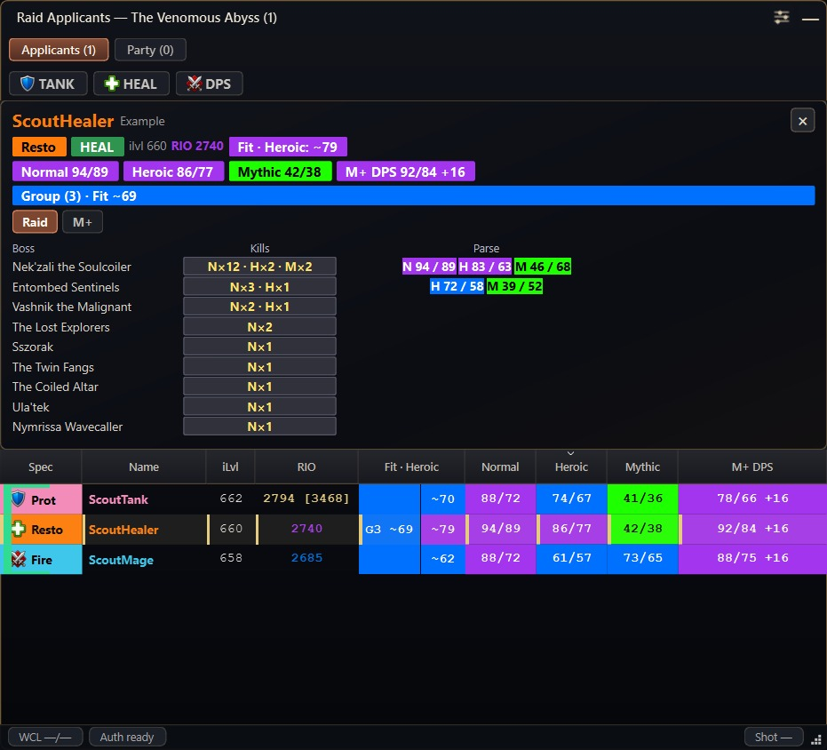
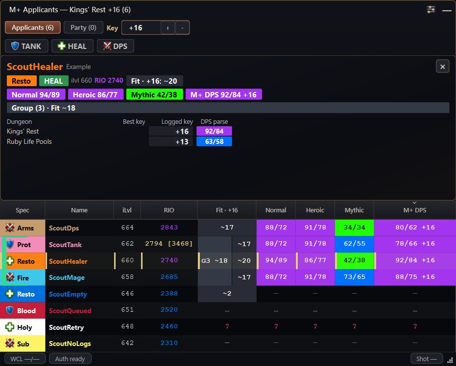

# ApplicantScout: LFG & Party Overlay

<p>
  <a href="https://github.com/Antrakt92/ApplicantScout-Addon/releases/latest"></a>
  <a href="https://github.com/Antrakt92/ApplicantScout-Companion/releases/latest"></a>
  
  
</p>

**Check applicants before you invite.**

See Warcraft Logs performance, RaiderIO scores, and dungeon or raid experience
beside Group Finder. Compare applicants in one table, inspect players who
applied together, or switch to Party view to review your current group.

**You need both this WoW addon and the free ApplicantScout Companion for
Windows.** The addon collects group information. The Windows app displays the
overlay shown below.

**[Get the Windows companion](https://github.com/Antrakt92/ApplicantScout-Companion/releases/latest)**
· **[Follow the setup guide](https://github.com/Antrakt92/ApplicantScout-Companion/blob/main/docs/GETTING_STARTED.md)**

On the download page, choose `ApplicantScoutCompanionSetup-*.exe` under
**Assets**. Setup also requires a free Warcraft Logs account and API client;
the guide walks through creating one. You do not need your Blizzard password.

<p align="center">
  
  
</p>

*The Windows companion displays these tables beside WoW. Installing the addon
alone does not display them.*

## What You Can Check

- **Applicants:** Warcraft Logs results, RaiderIO score, role, and item level.
- **Grouped applications:** each member's results and a combined Fit estimate.
- **Your party or raid:** review the roster after inviting players or joining a group.
- **Experience:** dungeon history for Mythic+ and raid progress where data is available.
- **Past seasons:** available local RaiderIO ratings, with the highest shown
  below the current rating when it is at least as high. Missing history is hidden.

The addon can default new M+ listings to Competitive. Choose another playstyle
or turn it off in settings. Auto Hi greetings are optional.

## Quick Setup

1. Install the addon through [CurseForge](https://www.curseforge.com/wow/addons/applicantscout-lfg-overlay)
   or download the packaged ZIP from the
   [latest addon release](https://github.com/Antrakt92/ApplicantScout-Addon/releases/latest).
2. Install the [Windows companion](https://github.com/Antrakt92/ApplicantScout-Companion/releases/latest)
   using `ApplicantScoutCompanionSetup-*.exe`.
3. Follow the [setup guide](https://github.com/Antrakt92/ApplicantScout-Companion/blob/main/docs/GETTING_STARTED.md)
   to create a free Warcraft Logs API client. Enter its Client ID/Secret in
   companion Settings and use **Test WCL** to check them.
4. Select the active WoW `_retail_\Screenshots` folder in companion Settings.
5. Reload WoW, then host a Mythic+ or raid listing, or join a group and select
   **Party** in the companion.

For a manual addon install, extract the packaged ZIP so the TOC is at
`_retail_\Interface\AddOns\ApplicantScout\ApplicantScout.toc`.
GitHub's automatic source-code ZIP uses the wrong folder name for WoW.

## Reading The Results

Normal, Heroic, Mythic, and M+ results use the applying specialization.
WCL percentiles keep their usual colours. Missing logs are marked as missing;
tooltips explain best/median values and limited samples.

**Fit**, shown as an estimate such as **~65**, describes how the available
data matches the target key or raid. It is not a success probability or a
Warcraft Logs percentile. Its colours use the same thresholds as WCL results.
Hover Fit for evidence strength, dungeon coverage,
and limitations. Optional local RaiderIO data adds dungeon, raid, and main-score
context when available.

Party also shows raid Fit without a Group Finder listing. Inside a raid it uses
the instance difficulty; outside it uses the selected Normal, Heroic or Mythic
raid difficulty. Click a column heading to sort and click again to reverse it.

**M+ WCL values measure damage for every role**, including tanks and healers.
They do not measure healing, survival, interrupts, or other utility.
ApplicantScout does not auto-invite players or automate gameplay; you choose
whom to invite.

## How It Works

The addon turns listing and roster information into QR images and takes normal
WoW screenshots. The companion reads those images, fetches Warcraft Logs data,
and updates the overlay. The QR frame appears only during the screenshot capture window.

Capture pauses during combat, throughout an active Mythic+ run, and during raid
boss encounters. It resumes out of combat between raid pulls so you can keep
recruiting.

ApplicantScout temporarily raises screenshot quality and uses JPG format only
during each QR capture, then restores your prior screenshot settings.
`/apscout off` or `/reload` also restores them if capture was interrupted.

## Privacy And Trust

ApplicantScout does not read WoW memory, inject code, automate gameplay, or send
chat messages as a transport. It does not ask for Blizzard credentials.

The companion watches the configured Screenshots folder, stores WCL credentials
locally, and can read optional RaiderIO data from
`_retail_\Interface\AddOns\RaiderIO\db`. Decoded RaiderIO data is cached in
`%LOCALAPPDATA%\applicant-scout\cache\raiderio-local`.

The companion offers optional usage statistics, enabled when no preference has
been saved. Existing choices are preserved. Reports contain a random installation
ID, version and daily milestones; names, screenshots and credentials are excluded.
Reports go to the ApplicantScout service hosted on Cloudflare. Turn sharing off
in Companion Settings at any time.
[Privacy details](https://github.com/Antrakt92/ApplicantScout-Companion/blob/main/docs/PRIVACY.md).

Current Windows builds are unsigned, so SmartScreen may warn on first install.
Download from the linked GitHub release. The `.sha256` sidecar verifies
file integrity, not publisher identity.

QR screenshots may remain if the companion is absent, interrupted, pointed at
the wrong folder, or the Screenshots folder is synced/shared before cleanup.

## Troubleshooting

- **Empty overlay:** check the companion's Screenshots path points to the active
  `_retail_\Screenshots` folder. Run `/apscout status` while hosting a listing;
  use `/apscout status diag` for detailed QR diagnostics.
- **Missing WCL results:** use **Test WCL** in companion Settings.
- **Stale applicants:** run `/apscout reset` while capture is active.
- **Manual refresh:** keep the addon enabled and run `/apscout shotnow`.
  It waits until combat, an active Mythic+ run, or a boss encounter ends.
- **Move the QR frame:** run `/apscout qrmove`, Alt-drag the frame, then run the
  command again to lock it. `/apscout qrreset` restores its default position.
- **Move the Group Finder window:** left-drag its background, title or buttons
  outside combat. Normal clicks still work; text fields, sliders and controls
  with their own drag actions keep those actions. Its
  position is kept while this UI session is running; `/reload` returns it to
  Blizzard's default position.
  Other open Blizzard windows stay in place while you drag Group Finder,
  including when a skin has docked the character window beside it.

## Handy Slash Commands

```text
/apscout on | off       enable/disable capture
/apscout toggle         flip enabled state
/apscout config         open/close settings panel
/apscout setup          show companion download and setup
/apscout status         show a short capture summary
/apscout status diag    show detailed QR diagnostics
/apscout playstyle [off|learning|relaxed|competitive|carry] set M+ default playstyle
/apscout reset          clear transport cache, queue fresh snapshot
/apscout shotnow        request snapshot while enabled; defers in combat/M+/boss fights
/apscout qrvisible      toggle persistent QR always-visible mode; off clears it
/apscout qrmove         toggle QR move mode (Alt+drag QR frame)
/apscout qrreset        reset QR frame position to top-left
/apscout taintcheck     probe C_LFGList field secret-tagging
/apscout debug [on|off] toggle debug logging
/apscout competitive [on|off] legacy alias for Competitive / Off
```

## Compatibility

- WoW Retail Midnight: Interfaces `120100, 120105`.
- One addon package supports Retail 12.1.0 and PTR 12.1.5. PTR compatibility
  is based on Blizzard UI source review; in-game PTR validation is still pending.
- Keep both the addon and Windows companion on their latest releases.
- Classic-era clients are not supported.

## Support And Contributions

Report in-game issues in the
[addon repository](https://github.com/Antrakt92/ApplicantScout-Addon/issues).
For the overlay, installer, or WCL setup, use the
[companion repository](https://github.com/Antrakt92/ApplicantScout-Companion/issues).
Include both versions and steps to reproduce the problem.

<details>
<summary>Before sharing logs or screenshots</summary>

Before sharing support material publicly, redact `/apscout status` and
`/apscout status diag` output,
`/apscout taintcheck` output, companion logs, QR screenshots, manual decode
output, `config.env`, `token.json`, `character-cache.json`,
`last-live-snapshot.json`, and `screenshot-manual-index-v2-*.json`.
These can include WCL Client ID/Secret, OAuth access token, character names,
realm names, applicant/roster snapshots, listing titles/comments,
screenshots folder paths, absolute screenshot file paths, and WCL/RaiderIO data.
Treat `%LOCALAPPDATA%\applicant-scout\config\` and
`%LOCALAPPDATA%\applicant-scout\cache\` as private;
do not attach either directory wholesale.

</details>

See [CONTRIBUTING.md](CONTRIBUTING.md) for development setup, checks, transport
details, and the development-only addon ZIP. Report security issues through
[SECURITY.md](SECURITY.md).

## License

ApplicantScout uses the [MIT license](LICENSE). The bundled QR encoder retains
its upstream BSD-3-Clause license; see [THIRD-PARTY-NOTICES.md](THIRD-PARTY-NOTICES.md)
and the header in [libs/qrencode.lua](libs/qrencode.lua).
